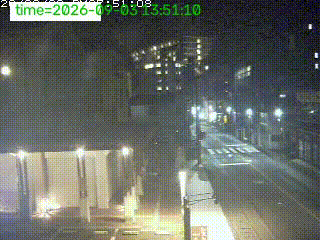

# MOTION DETECTOR(учебный проект)
Определяет движение на видео с камер видеонаблюдения(rtsp-потоки) 

## Demo


## Features
- определяет движение на кадре с помощью метода 

## Tech Stack
- Python, OpenCV, NumPy, Pandas


## Usage
\```
просто запустить файл app.py
\```

## Configuration
config.yaml:
- `VIDEO_STORAGE_PATH` путь к файлу для сохранения фрагментов видео с движением
- `LOGGER_PATH_TO_LOG_FILE` путь к файлу для логгирования
- `LOGGER_PATH_TO_CSV_FILE` путь к файлу для записи данных в csv файл 
- `RTSP_URL` - ссылка, которая ведет на вашу видеокамеру 
- `CLEAR_MASK_KERNEL_SHAPE` - shape для ядра фильтров для чистки маски(см src/utils.py метод clear_mask)
- `MIN_AREA` - минимальное количество ненулевых пикселей на маске выше которого мы считаем что движение произошло
- `MIN_CONTOUR_AREA` - минимальная площадь контура начиная с которой мы наносим его bbox-ы на записываемые кадры в память и сsv файл  
## Project Structure
\```
project/

├── src/

│   ├── move_detection.py

│   └── utils.py

├── app.py

├── config.yaml

└── requirements.txt
\```

## How it works
детекция происходит спомощью метода `MOG2 background subtraction`, который встроен в OpenCV
- с помощью `createBackgroundSubtractorMOG2` мы получаем маску на наш кадр 
- маску мы фильтруем с момощью `clear_mask` из `utils.py`
- далее мы говорим что движение замечано если количество ненулевых пикселей на маске больше `MIN_AREA`
- если движение обнаружено, то мы определяем bbox-ы движущихся объектов и записываем их в csv файл и на итоговые кадры 
